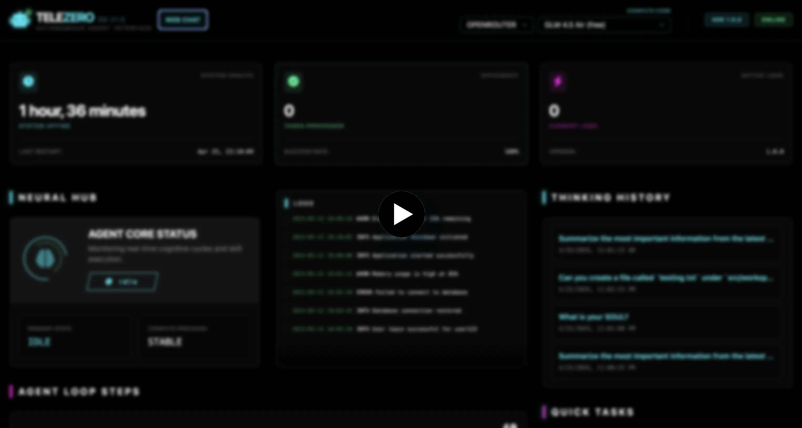

# TeleZero

TeleZero is a lightweight (~226 KB) TypeScript autonomous agent that runs via Telegram and a local dashboard without Docker. It uses an LLM reasoning loop with real tools, stores conversations and jobs in SQLite, and supports cron-based background tasks.

> TeleZero is in beta and not recommended for production use yet.
> Note: Use at your own risk. The agent can access files in your folders/repositories based on granted tool capabilities.

**Author:** [ronaldaug](https://github.com/ronaldaug)  
**Project page:** [ai.jsx.pm](https://ai.jsx.pm)

<a href="https://www.youtube.com/watch?v=ojePCiPpQ2g" target="_blank"></a>

---

## Why telezero?

I wanted something like OpenClaw, but simpler: small, light, works with free models, and easy to read the code.

- OpenClaw is huge (about 400 MB). It can be hard to see what it is doing under the hood.
- TeleZero is about 226 KB. You can open the files and follow how it works.
- A lot of similar tools use Docker. Docker uses RAM even when it is just sitting there.
- TeleZero runs without Docker. You can hook it up to Telegram with webhooks and avoid keeping big containers running all day.

---

## Quick Start

1. Run interactive setup:

```bash
npm run setup
```

Setup will:
- install dependencies (`npm install`)
- ask for owner/agent names and patch workspace identity files
- create/update `.env` (including `TELEGRAM_BOT_TOKEN`, `TELEGRAM_CHAT_ID`, and optional model keys)
- run `npm run build`

2. Start development runtime (main app + dashboard):

```bash
npm run telezero
```

3. Open dashboard:

`http://localhost:1337`

---

## Features

- Telegram bot powered by `gramio` with persisted chat history
- Agent reasoning loop with tool execution:
  - `read_file`
  - `write_file`
  - `list_directory`
  - `run_command`
- SQLite-backed storage for sessions, messages, jobs, and dashboard users
- Dashboard APIs for:
  - auth/login setup
  - live status, logs, and recent agent/job activity
  - model/provider + model-id switching
  - Telegram polling/webhook controls
  - max agent-loop-steps controls
  - web chat with multi-message history
- Cron scheduler + agent-driven cron task runner

---

## Skills

TeleZero loads skills from `src/workspace/skills/<skill-name>/`.

Each skill directory can use:
- `SOUL.md` (preferred)
- `SKILL.md` (legacy fallback)

### Add a skill

1. Create a skill directory:

```bash
mkdir -p src/workspace/skills/my-skill
```

2. Add `SOUL.md` with usage and examples:

```md
# My Skill

## When to use
- User asks to do X

## Inputs
- input: string
```

3. If running with `npm run telezero`, changes under `src/workspace/skills` sync automatically for dev runtime.  
   Otherwise run:

```bash
npm run build
```

4. Test via Telegram or dashboard web chat.

---

## Agent Brain Files

Core behavior comes from markdown files in `src/workspace/`:

- `SOUL.md` - reasoning principles
- `IDENTITY.md` - assistant persona/voice
- `USER.md` - owner context and preferences
- `TOOLS.md` - capability and skill-directory instructions
- `HEARTBEAT.md` - runtime state/pulse guidance
- `AGENT_STEP.md` - JSON step protocol (`thought`, `action`, `input`, `done`)

`AGENT_STEP.md` can be overridden with `TELEZERO_AGENT_STEP_PATH` (absolute path or path relative to project root).

---

## NPM Scripts

- `npm run setup` - interactive initialization (workspace + env + install + build)
- `npm run telezero` - dev launcher (build, workspace watch sync, bot, dashboard)
- `npm run build` - TypeScript build + copy workspace/database schema into `dist/`
- `npm start` - run production build from `dist/index.js`
- `npm run db:migrate` - apply SQLite schema
- `npm run agent -- "your task"` - run one task from CLI
- `npm run dashboard` - run dashboard server only
- `npm run dashboard:dev` - run Vite dev server
- `npm run dashboard:build` - build dashboard frontend assets
- `npm test` - run Jest tests

---

## Configuration

### Environment variables

From `.env.example`:

- `TELEGRAM_BOT_TOKEN` - Telegram bot token from @BotFather
- `GEMINI_API_KEY` - Gemini key (if using Gemini provider/models)
- `DATABASE_URL` - SQLite file path (default `data/telezero.db`)
- `TELEZERO_AGENT_STEP_PATH` - optional custom prompt path for `AGENT_STEP.md`

Setup also prompts for:
- `TELEGRAM_CHAT_ID`
- `OPENROUTER_API_KEY` (optional)
- `GEMINI_API_KEY` (optional)

Depending on entries in `.telezero-model.json`, you may also need:
- `GLM_API_KEY`
- `TOKEN_MAX_API_KEY`
- `OPENROUTER_API_KEY`

### Model providers

Runtime/provider settings are in `.telezero-model.json`.

Supported provider keys:
- `qwen`
- `ollama`
- `gemini`
- `openai`
- `openrouter`

Each provider can define model entries with:
- `id`
- `name`
- optional `baseUrl`
- optional `envKey`

---

## Runtime Flow

1. Input arrives from Telegram, web chat, CLI, or cron task
2. Conversation/history is loaded when available
3. Agent composes context from workspace files + registered skills
4. LLM returns a JSON next step
5. Selected tool executes
6. Loop repeats until `done: true`
7. Final answer is returned to caller (Telegram, web chat, CLI, or logs)

---

## Project Structure

```text
telezero/
├── src/
│   ├── index.ts                  # Main app entry (bot + scheduler)
│   ├── agent/                    # Task orchestration + reasoning loop
│   ├── llm/                      # Provider/model routing + prompt assembly
│   ├── services/                 # Qwen/Ollama/Gemini/OpenAI-compatible handlers
│   ├── telegram/                 # Telegram bot + middleware
│   ├── dashboard/                # Express dashboard/API server
│   ├── database/                 # SQLite connection + schema
│   ├── cron/                     # Scheduler bootstrapping
│   ├── tasks/                    # Agent-driven cron tasks
│   ├── tools/                    # Tool implementations (files/shell)
│   └── workspace/                # Agent context + skills
├── scripts/                      # setup/dev/dashboard/migrate/task scripts
├── public/                       # Served dashboard assets
├── docs/                         # Extended documentation
├── .telezero-model.json          # Provider/model config
└── .env.example                  # Environment template
```

---

## Documentation

Extended docs in `docs/`:

- `docs/getting-started.md`
- `docs/architecture.md`
- `docs/agent-system.md`
- `docs/skills-system.md`
- `docs/database.md`
- `docs/telegram-bot.md`
- `docs/llm-integration.md`
- `docs/dashboard.md`
- `docs/development.md`
- `docs/deployment.md`

## License

MIT